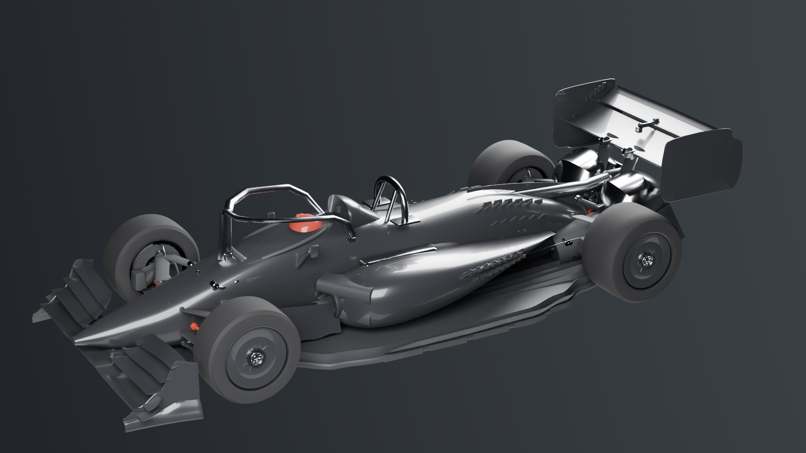

# VX-1 "Vortex" — ground-effect fan car

A complete racing car generated procedurally in Blender from a single
specification file, designed around one question: **what would it take to beat
a Formula 1 car on a Formula 1 circuit?**

The power unit is the [RX-8V V8 hybrid](https://github.com/krabduke/car-engine-v8-hybrid)
from the sibling project, imported and installed — not re-modelled.

**220 assemblies · 4,930 × 2,001 mm · 700 kg · 1,254 hp · 650 kg of fan downforce**



## The argument

An F1 car is not slow because nobody can build a faster one. It is slow because
the rulebook caps it: 798 kg minimum, fixed floor geometry, no movable aero
beyond DRS, no fans, and a power unit limited to roughly 1000 hp. Remove the
regulations and there are four places to take time, in order of value:

**1. Fan-driven downforce.** A wing makes downforce proportional to v², so it
gives almost nothing in slow corners — exactly where lap time is lost. Two
electrically driven fans extract air from sealed underfloor plenums and produce
downforce that barely varies with road speed. This is the single biggest win,
and the car is shaped around it.

**2. Ground effect without a rulebook.** Full-length venturi tunnels with a
steep diffuser, sealed by skirts that the fans keep loaded.

**3. Active aero.** Front and rear elements trim continuously, so the car never
has to compromise between a low-drag straight and a high-downforce corner.

**4. Mass and power.** 700 kg against F1's 798 kg minimum, and 935 kW against
roughly 750 kW.

## What that buys

| | VX-1 | F1 reference | |
|---|---|---|---|
| Lateral g at 80 km/h | **3.59** | 2.05 | +75 % |
| Lateral g at 150 km/h | **4.51** | 2.78 | +62 % |
| Lateral g at 250 km/h | **6.72** | 4.50 | +49 % |
| R25 m hairpin | **112 km/h** | 81 km/h | +31 |
| R60 m corner | **208 km/h** | 143 km/h | +65 |
| R120 m corner | **327 km/h** | 281 km/h | +46 |
| Power to weight | **1.34 kW/kg** | 0.94 | +42 % |
| Top speed | **388 km/h** | ~340 | |

The advantage is **largest at low speed and shrinks as speed rises** — which is
exactly the signature of a fan car, and the reason this layout was chosen over
simply adding more wing.

Note the last row of the grip table: at 250 km/h the car is already at 6.7 g,
and the model caps it at 7 g because **the driver becomes the limiting
component before the tyres do.**

## Specification

| | |
|---|---|
| Length × width × height | 4,980 × 1,980 × 1,015 mm |
| Wheelbase / track | 3,150 / 1,660 front, 1,600 rear |
| Mass | 700 kg, 56.5 % rear, CG 258 mm |
| ClA / CdA | 5.90 / 1.62 (4.65 with active aero shed) |
| Fan system | 2 × 560 mm, 13 blades, 7,200 rpm, 62 kW, 650 kg |
| Engine | RX-8V 2.0 L V8 twin-turbo hybrid, 935 kW |
| Tyres | 305/670 front, 405/690 rear on 18-inch rims |
| Ride height | 22 mm front, 58 mm rear (rake feeds the tunnels) |

## Build

Requires Blender (`brew install --cask blender`). Nothing else.

```
make build      # generate geometry, assemble build/car.blend, write parts.csv
make verify     # the car's 45 design checks, then every audit of the build
make render     # hero, plan, cutaway and exploded views
make export     # build/car.glb
make manifest   # viewer/parts.json
make viewer     # serve the interactive viewer
```

## Verification

`make verify` runs `car/verify.py`, 45 checks, and then sixteen audits of the
build: structure, geometry, closed surfaces, interference between parts,
joints and supports, the underfloor, the fan exhaust, the lap simulation,
fit inside the bodywork, the viewer's manifest and scripts, the vendored
engine and the panel solver. In `car/verify.py`, dimensions are measured out of
`build/parts.csv`; the rest are design rules, including direct comparisons
against the F1 reference:

- Plan dimensions, wheelbase, track inside overall width, rake
- Mass, weight distribution, CG height, and that it undercuts the F1 minimum
- ClA, lift-to-drag, aero balance, fan downforce and fan power draw
- **Out-grips F1 at 80, 150 and 250 km/h**, and that the advantage is largest
  at low speed — if that ever inverts, the fan has stopped being the point
- Peak sustained lateral g inside the driver limit
- Faster through R25, R60 and R120 m corners
- Power-to-weight, top speed

The width check caught a real error: a broken rotation was throwing the
radiators a metre outside the bodywork.

## The performance model

`spec.py` contains a first-order model, not a simulation. Three things in it
matter, because without them it produces nonsense:

- **Tyre load sensitivity.** μ falls as vertical load rises. The first version
  used a constant μ and cheerfully predicted 14 lateral g and infinite corner
  speeds.
- **Fan downforce independent of speed.** This is what the whole concept rests
  on, and it is modelled as a constant rather than folded into ClA.
- **A driver g-limit.** At large corner radii the car is limited by the human
  in it, and the model says so.

## Aerodynamic simulation

The wings are solved with a **vortex-lattice method** — a real three-dimensional
potential-flow solve, not a coefficient lookup. Each panel carries a horseshoe
vortex; flow tangency is enforced at every collocation point; induced drag comes
from the Trefftz plane; and the track is made an exact streamline by mirroring
the whole vortex system in it.

```
make validate    # check the solver against lifting-line theory first
make aero        # solve the car's wings in ground effect
```

The solver is validated before it is used. Against finite-span theory it gets
the lift slope within 5.6 % across AR 4–12, returns a span efficiency of 0.99
for a rectangular AR 8 wing, and reproduces ground effect correctly: +59 % lift
at h/c = 0.25. The car's own lattice is then refined from 2 to 12 panels per
chord and has to hold still — within 5 % on downforce and 8 % on drag — and the
spanwise loading is checked for the alternating sign that a near-singular
influence matrix produces. Agreement between the two solvers is not enough on
its own: both read `spec.py`, so a lattice that cannot resolve the car agrees
with itself.

Results for the car's wings, at 250 km/h:

| | |
|---|---|
| Downforce, free air | 656 kg |
| Downforce, in ground effect | **789 kg** (+20.3 %) |
| Induced drag | 115 kg-force, CDi 0.155 |
| Lift / induced drag | 6.9 |
| At 300 km/h | 1,135 kg — 162 % of the car's mass |

**What the solve does not cover, and why the numbers should not be over-read:**

- It models the **wings only**. The floor, venturi tunnels, diffuser and fans
  are the car's main downforce source, and they are viscous, ducted and
  fan-driven — a potential-flow lattice cannot touch them. The floor and fan
  figures in `spec.py` come from the performance model and this analysis does
  not confirm them.
- It **under-reads a slotted multi-element wing.** The slot flow that makes the
  four front elements work is viscous; in a lattice they shadow each other. The
  11.9 % front-wing share it reports is a floor, not a figure.
- It is **inviscid**: no boundary layer, no separation, no stall, and no profile
  or pressure drag. Total drag is higher than CDi.

Fixing the Trefftz routine to work in the full crossflow plane was needed for
this car: the original collapsed every wake onto the y axis, which is exact for
one planar wing and nonsense for a front wing, rear wing and beam wing shedding
at the same span stations at different heights. It reported CDi above 20.

## Layout

```
car/
  spec.py        every dimension, mass, coefficient and material, plus the
                 performance model. No geometry module holds a literal dimension
  parts/
    chassis.py   tub, nose, sidepods, engine cover, airbox, halo, cockpit
    floor.py     plank, venturi tunnels, diffuser, strakes, skirts
    wings.py     4-element front wing, 2-element rear wing, endplates, pylons
    wheels.py    per corner: tyre, rim with spokes, wheel cover and nut,
                 ventilated disc, six-pot caliper, upright
    suspension.py wishbones as aerofoil fairings, pushrods, pullrods, rockers
    aerodetail.py bargeboards, turning vanes, floor fences, brake ducts,
                 mirrors, cameras, rain light, exhaust
    detail.py    cooling gills, front wing pylons, nose cape, crash
                 structures, roll-hoop airbox, driver, jack and tow points
    systems.py   brake duct internals, hydraulics, wiring loom, cockpit,
                 survival cell bulkheads, pit hardware, cooling exits
powerunit/       the engine, vendored from the sibling project by
                 tools/vendor_engine.py — `make vendor` refreshes it and
                 verify.py fails the build if the copy has gone stale
    fans.py      the fan system — shrouds, rotors, motors, plenum throats
    powertrain.py imports and installs the RX-8V, plus gearbox, radiators,
                 battery and fuel cell
  verify.py      measures the result and checks it against F1
powerunit/       the engine generators, vendored from the sibling project
```

## Honesty

This is a **design study with a coherent first-order performance model**, not a
validated race car. There is a validated vortex-lattice solve of the wings (above) but no CFD of
the floor or the fans, no structural analysis, no tyre model
beyond a load-sensitivity exponent, no suspension kinematics solved through
travel, and no lap simulation. The aerodynamic coefficients are targets chosen
to be plausible for the configuration, not results.

What it does do is state its assumptions in one file, check them against each
other, and show its working against a named reference.

## License

MIT — see [LICENSE](LICENSE).
